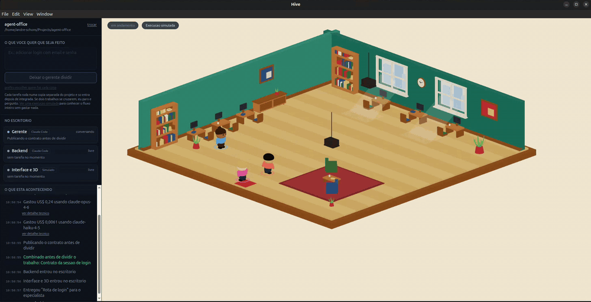

# Hive

**Um orquestrador de agentes de IA que você assiste acontecer.** Você descreve o
que quer; ele roda a CLI do Claude Code que já está instalada no seu terminal
como vários agentes trabalhando no mesmo repositório ao mesmo tempo, cada um na
sua cópia isolada. A execução inteira acontece num escritório 3D isométrico,
onde dá para ver quem está fazendo o quê, quem travou e quanto cada um já
custou.

[English](./README.md) · [Arquitetura](./CLAUDE.md) · [Como contribuir](./CONTRIBUTING.md)



> [!IMPORTANT]
> **Hoje isto roda no Linux.** Foi onde o projeto foi desenvolvido e é o único
> sistema onde ele foi testado. O código não é hostil às outras plataformas — a
> replicação de dependências já cai para instalação completa quando o hardlink
> não está disponível — mas ninguém rodou ainda. Se você tem um Mac ou um Windows
> e vinte minutos, [abra uma issue contando o que aconteceu](../../issues/new).
> É a contribuição mais útil possível neste momento.

## O que é, e para quem

O público-alvo é quem **não lê código**. A pessoa descreve a tarefa em linguagem
simples, o sistema coordena os agentes até a entrega e **para para perguntar em
linguagem simples** quando trava. Escalonamento é a experiência principal, não um
caminho de erro.

É por isso que o 3D não é enfeite. Uma barra de progresso não diz onde a coisa
emperrou. Um personagem parado na mesa com uma pergunta flutuando sobre a cabeça
diz.

## A aposta: qualidade, desempenho e custo ao mesmo tempo

**Qualidade — nenhum agente aprova o próprio trabalho.** Toda subtarefa passa por
um comando do próprio projeto (`typecheck`, `build`, `test`, `lint`), rodado por
fora, na cópia daquele agente, com o código de saída como único critério.
"Terminei" sem portão verde não é entrega aceita. E há um segundo portão depois
da integração, no repositório já mergeado, para o caso que ninguém prevê: dois
passos que passam sozinhos e não passam juntos, porque cada cópia saiu do mesmo
ponto de partida e não conhecia o trabalho do outro.

**Custo — medido, com a conta aberta.** A primeira versão era **57% mais cara que
rodar a CLI na mão**, só para planejar, antes de tocar em nada. A medição mostrou
por quê: 74% do custo estava no gerente, em *decidir* o que fazer. O agente que
fazia o trabalho custou US$ 0,084 contra os US$ 0,19 que a CLI cobrou pela mesma
mudança. Execução já era barata; coordenação é que era cara.

| caminho | custo | tempo | vs. CLI |
| --- | ---: | ---: | --- |
| `claude -p` direto | US$ 0,1921 | 9,2 s | — |
| **Hive, fila manual, econômico** | **US$ 0,0599** | 33,9 s | **3,2x mais barato** |
| Hive, planejado, gerente sonnet | US$ 0,1637 | 44,9 s | 1,2x mais barato |
| Hive, planejado, gerente opus | US$ 0,3337 | 78,0 s | 1,7x mais caro |

Todas as linhas entregaram a mesma mudança. Só as do Hive passaram por
verificação automática antes de integrar. Método e números crus em
[`tools/planner-lab/BASELINE.md`](./tools/planner-lab/BASELINE.md).

**Desempenho — instrumento pronto, número ainda em aberto.** Dois especialistas
trabalham ao mesmo tempo quando o plano prova que as áreas deles não se cruzam —
e só nesse caso, porque paralelizar sobre a mesma pasta é conflito previsível,
não azar. O overhead do sistema já caiu forte: preparar a cópia de um agente foi
de 16s para **0,12s**, replicando 600 MB de dependências por hardlink em vez de
reinstalar, e o portão completo roda em 0,95s com cache cheio.

O que ainda não existe é a medição ponta a ponta de uma execução paralela de
verdade. `plan.measured` calcula isso — a soma do que cada passo ocupou contra o
relógio de parede — e sai em todo plano executado, **inclusive quando a execução
para no meio**, porque medida só serve se existir também no dia em que deu
errado. Nenhuma rodada com duas frentes foi registrada na linha de base ainda.
[É uma issue aberta](../../issues), e das boas.

## Pré-requisitos

- **Linux** (veja o aviso acima)
- **Node.js 20+** e **pnpm**
- **CLI do [Claude Code](https://claude.com/claude-code) instalada e
  autenticada.** O orquestrador roda ela como processo filho — não há runtime de
  agente próprio nem chamada direta a API de modelo. Confira com
  `claude --version`. É a única CLI suportada hoje — `AgentAdapter` é o ponto de
  extensão para quem quiser somar outra.
Rodar agentes gasta dinheiro da sua própria conta, na tabela do seu provedor. Os
números acima são o que uma mudança de uma linha custou aqui.

## Rodando

```sh
pnpm install
pnpm app
```

Escolha uma pasta de projeto, escreva uma task, e a execução roda o fluxo
inteiro: plano, aprovação, contrato, trabalho em paralelo, verificação, e uma
pergunta que para tudo até você responder.

Para ver o fluxo **sem gastar uma única chamada de modelo**, alimente o mesmo
banco pelo simulador, com o app aberto naquela pasta:

```sh
pnpm --filter @office/simulator start -- \
  --db ~/.config/hive/hive.sqlite \
  --project /caminho/do/projeto
```

### Nota de Linux

O Electron 44 não tem mais `postinstall` próprio: o binário é baixado pelo script
`install-electron` de `apps/shell`. Em distros que restringem user namespaces, o
`chrome-sandbox` precisa ser `root:root` com modo 4755:

```sh
sudo chown root:root node_modules/.pnpm/electron@*/node_modules/electron/dist/chrome-sandbox
sudo chmod 4755 node_modules/.pnpm/electron@*/node_modules/electron/dist/chrome-sandbox
```

Sem isso o app aborta na inicialização. `pnpm app:nosandbox` contorna para
desenvolver — desliga o sandbox do Chromium, então serve para a sua própria
máquina e não para virar o caminho padrão.

## Segurança — leia antes de apontar para trabalho de verdade

Este app roda CLIs de agente como processos filhos na sua máquina, e elas editam
arquivos. A política de permissão
([`packages/agents/src/permission.ts`](./packages/agents/src/permission.ts), uma
só para todas as CLIs) traça a linha assim:

- **Liberado sem perguntar:** ler, buscar e escrever arquivos **dentro da pasta
  de projeto que você escolheu**. Parar a cada arquivo tornaria o produto
  inusável.
- **Escalado como pergunta para você:** qualquer coisa fora dessa pasta, rodar
  comando de shell, e acesso à rede. A CLI suspende o agente e espera a sua
  resposta — é dali que sai o estado `blocked`.
- **Planejar é somente-leitura.** O gerente roda com escrita negada mesmo dentro
  do projeto, porque planejar é olhar.

Agentes nunca trabalham no seu repositório direto. Cada um recebe uma git
worktree em `<userData>/worktrees/<runId>/<agentId>`, **fora** do seu repo, e quem
commita e mergeia é o supervisor, não o agente. Conflito nunca é resolvido em
silêncio: o sistema para, reporta e pergunta.

Nada disso torna seguro apontar para um repositório que você não pode se dar ao
luxo de ver editado. Use um projeto com git limpo e um remote para onde você
consiga voltar.

## Arquitetura

[`CLAUDE.md`](./CLAUDE.md) é o documento de projeto de verdade: fronteiras entre
pacotes, por que cada regra existe, e as descobertas de que o código depende.
Versão curta:

```
packages/protocol      nao depende de nada. Todo o resto depende dele.
packages/store         protocol                 -- unico pacote que toca SQLite
packages/agents        protocol                 -- um AgentAdapter por CLI
packages/coordination  protocol, agents         -- nunca apps/*
apps/shell             protocol, store, agents, coordination, simulator
apps/hub               protocol                 -- e so
tools/simulator        protocol, store
tools/planner-lab      protocol, agents, coordination
```

Todo evento vai para SQLite append-only com número de sequência, e o mundo 3D
reproduz uma execução inteira a partir do log, sem rodar agente.

## Comandos

```sh
pnpm build          # todos os pacotes
pnpm typecheck
pnpm test
pnpm dev            # vite + electron com recarga
pnpm app            # compila e abre o app
pnpm app:nosandbox  # idem, sem o sandbox do Chromium (ver nota de Linux)
pnpm plan-lab -- --task all --project .   # so o gerente, sem executar nada
```

O `plan-lab` é o loop de realimentação mais barato do repositório: roda só o
gerente sobre dez tasks de exemplo e imprime custo por task e da rodada, então
afinar o prompt de planejamento custa dez planejamentos em vez de dez execuções.

## O que ainda não existe

Dito na cara, porque é onde está o trabalho:

- **Outras plataformas.** macOS provavelmente está perto — o `cp` do BSD aceita
  `-a` e `-l`, então a replicação por hardlink talvez já funcione — mas ninguém
  rodou. Windows precisa de matar grupo de processos de verdade (`taskkill /T` ou
  um job object) para um portão que estourou o prazo não deixar compilador
  rodando.
- **Pathfinding de verdade no 3D.** O caminho ainda é um L de dois trechos. Móvel
  novo no meio da sala pede rota escrita à mão.
- **Replanejamento automático** depois de subtarefa que falha. `Planner.revise`
  existe e ninguém chama.
- **Brief do projeto injetado em cada subtarefa** — o maior corte de tokens que
  sobra, e item 1 do roadmap de custo na linha de base.
- **Subir de modelo quando o portão reprova**, em vez de repetir o mesmo degrau.
- **Mais de dois agentes ao mesmo tempo**, se o `plan.measured` mostrar antes que
  o merge não vira o gargalo.
- Autenticação, e empacotamento para distribuição.

## Contribuindo

Sim, por favor — inclusive "clonei, rodei, e quebrou aqui".
O [`CONTRIBUTING.md`](./CONTRIBUTING.md) organiza o trabalho aberto por quanto
contexto ele exige, começando pelo que quase não exige nenhum.

## Licença

[MIT](./LICENSE) © Andre Schons
